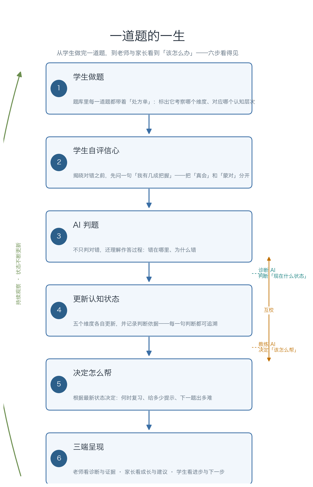

# ECOS 教育认知操作系统：让 AI 真正「看见」每个学生的成长

> 一份面向学校管理者的通俗介绍 · 阅读约 8 分钟
> 校方项目合作负责人（有技术背景）请另见 [_技术合作说明_](for-partners.md)

## 写在前面：一个校长每天都会遇到的问题

一个班 45 个学生，期中考试之后，老师能看到的是**几十个分数**。但分数背后的问题，往往看不全：

- 两个孩子都考了 78 分，但一个是"公式没记住"，另一个是"公式记得、遇到新题不会套用"——他们需要完全不同的帮助；
- 有个孩子平时作业都对，一考试就慌——是"不会"，还是"没信心"，分数看不出来；
- 面对几十个学生，老师很难做到对每个孩子都"心里有数"。

**ECOS 想做的，就是帮学校补上这块缺口：让系统像一位耐心、不知疲倦的助教，持续观察每一个学生，清楚他/她"知道了什么、卡在哪里、有没有信心"，并据此给出有针对性的教学建议。**

---

## 一、传统辅导系统在做什么——以及它们做不到什么

今天绝大多数教育系统（题库、刷题 App、阅卷系统），运行的基本是同一套模式：

```
出题 → 学生作答 → 判对错 → 按正确率推下一题 → 出分报告
```

这套模式很成熟，但有一个根本局限：**它只看到"结果"（对/错），看不到"过程"（为什么错），更看不到"状态"（认知发展到了哪一步）。**

打个比方：

> 传统题库像一台**阅卷机**，它能精确告诉你"对了"还是"错了"；
> 而我们需要的是**体检仪**——不仅告诉你"哪里出问题"，还能告诉你"属于哪一类问题""严不严重""该怎么调理"。

ECOS 想做的，就是从"阅卷机"走向"认知体检仪"。下文我常会提到"认知体检档案"，你可以把它理解为：给每个学生建立的一份**持续更新的、关于"学得怎么样"的动态档案**。

---

## 二、我们的思路：从「对错」走向「认知状态」

ECOS 全称"教育认知操作系统"。名字听起来大，落到教学上，核心是三个朴素的想法：

### 1. 看"状态"，而不是只看"分数"

系统给学生追踪的，不是单一分数，而是**五个维度的认知状态**：

| 维度 | 通俗含义 | 回答的问题 |
|---|---|---|
| 知识 | 概念、事实记没记住 | "他记住了吗？" |
| 方法 | 会不会按步骤去做 | "他会做吗？" |
| 思维 | 有没有思路、会不会迁移 | "遇到新题有办法吗？" |
| 信心 | 对自己会不会的把握 | "他有底气吗？" |
| 独立 | 需不需要外界提示 | "离开帮助能独立完成吗？" |

这样一来，"两个 78 分"就不再是同一回事：一个可能"知识"不足，另一个可能"思维"卡壳——系统分别标记，老师分别处理。

### 2. "会"不是一个开关，而是一层层台阶

我们常说学生"会了"或"不会"，但"会"其实有层次。借鉴国际上成熟的认知分类（布鲁姆认知目标分类，Bloom），系统把"会"拆成六层台阶：

```
记住 → 理解 → 应用 → 分析 → 评价 → 创造
（记公式）（懂原理）（会套用）（能拆解）（能判断）（能创新）
```

只会"背公式"的学生，和能"创造性地用公式解新题"的学生，掌握程度完全不同。系统会告诉老师：这孩子究竟站在哪一层台阶上。

### 3. 两个 AI 分工，互相监督

ECOS 内部有两个"智能体"（可以理解为两个各司其职的 AI 助手）协同工作：

- **诊断 AI**：持续判断学生"现在是什么状态"；
- **教练 AI**：根据诊断结果，决定"接下来该怎么帮这个学生"。

关键是——**它们会互相校验**。一方"开方"之前，另一方要"复诊"；判断没把握，就不乱下结论。这大大降低了 AI"想当然"的风险。

> 一句话：一个当**诊断医生**，一个当**开方老师**，互相监督。

---

## 三、完整流程：一道题从做完，到家长看到报告

这是 ECOS 最核心的部分。我们用"一道题的一生"走一遍，让每一步都看得见。下图把六步串成一张总览：



**第 1 步 · 学生做题**
题库里每一道题，背后都预先标好了"处方单"：它考察哪个维度（知识/方法/思维/信心/独立）、对应哪个认知层次。这样系统才知道，这道题答对或答错，说明了什么。

**第 2 步 · 学生自评信心**
做完题、在揭晓对错**之前**，系统先请学生自评一句："这道题我有几成把握？"
这一步很关键——它把"真会"和"蒙对"、"真不会"和"会但没自信"区分开来。光靠对错是分不清的。

**第 3 步 · AI 判题**
系统判分，并尽量理解作答的**过程**：不只是对错，还有错在哪里、为什么错。

**第 4 步 · 更新认知状态**
根据作答和自评，那"五个维度"各自更新。同时系统记录**判断依据**——它依据哪些题、哪些证据得出"这孩子知识维度偏弱"——每一句判断都可追溯。

**第 5 步 · 决定怎么帮**
教练 AI 根据最新状态决定干预的时机与方式：哪些知识该复习了（人的记忆会遗忘，系统知道何时提示复习最合适）、这道题给多少提示、下一道题出多难。

**第 6 步 · 三端呈现**
- **老师端**：看到全班每个孩子的诊断 + 判断依据（"系统为什么这么判断"）；
- **家长端**：看到自己孩子的成长趋势与通俗建议；
- **学生端**：看到自己的进步与下一步。

一句话概括这条流程：

> **学生做题 → 系统不只判对错，而是持续更新"这孩子学到了什么程度"的体检档案 → 老师和家长看到的是"怎么办"，而不是"多少分"。**

---

## 四、为什么需要它（必要性）

对今天的一线教学，有三个现实困难，正是本系统的用武之地：

1. **分层教学难**：一个班水平参差，老师很难为每个层次单独出方案。系统自动给出"每个孩子当前最需要什么"，让分层有了抓手。
2. **教师精力有限**：老师最宝贵的时间，不该花在"反复翻试卷判断每个孩子错在哪一类"上。系统接过这块机械劳动，老师专注在"人"上。
3. **"减负"要落到"提质"**：减负不是简单少做题，而是"每道题都有用"。系统让练习更有针对性，少而精。

---

## 五、为什么现在可行（可行性）

这不是停留在想法阶段——系统已经是**可以运行的原型**。支撑它可靠运行的，有几件事：

- **已经能用**：学生做题、AI 判题、五维追踪、老师/家长两端查看，端到端已跑通；
- **质量有保障**：系统带有一套自动化测试（超过 1500 项），每次改动都经严格校验，尽最大可能避免"越改越坏"；
- **数据不出校（重点）**：系统可整套部署在**学校本地**，学生的答题与成长数据存在校内、不上传云端——符合学校对学生隐私的最严格要求；
- **试点方案已就绪**：针对"系统到底准不准、好不好用"，我们准备了小规模试点的验证方案，用真实数据检验后再逐步推广。

> 诚实地说：这是一套**已可用的原型系统，正处于用真实学生数据来验证和改进的阶段**。我们不夸大它已是"完美成熟的成品"——但它的核心思路与可用性，已落地到可以试点的程度。

---

## 六、常见问题（FAQ）

**Q：学生的数据安全吗？**
A：系统可全程部署在学校本地，数据留在校内、不上传外部服务器。若个别功能需借助更强的外部 AI 能力，会事先说明并经过授权，同时对数据做脱敏处理。

**Q：AI 会替代老师吗？**
A：不会，也替代不了。ECOS 扮演的是"助教"——把观察、判断、记录这些琐碎的事接过去，让老师把精力放在只有人能做的事上：启发、鼓励、因材施教的临场判断。**老师是决策者，系统是提供依据的工具。**

**Q：会不会增加学生负担？**
A：不会额外增加题量。学生只多做了件事——做完题后花几秒自评"有无把握"，其余都在正常学习流程内完成。

**Q：老师需要额外学很多技术吗？**
A：几乎不用。老师面对的是直观的报告页面，看到的是"每个孩子的情况和建议"，不是代码或复杂图表。

---

## 结语

教育里最珍贵、也最稀缺的资源，是**老师对每个孩子的"心里有数"**。

ECOS 的目标，不是造一个更聪明的题库，而是用 AI 帮学校、帮老师，把这句"心里有数"变得**可落地、可追溯、可持续**——让每一个孩子，都能被真正"看见"。